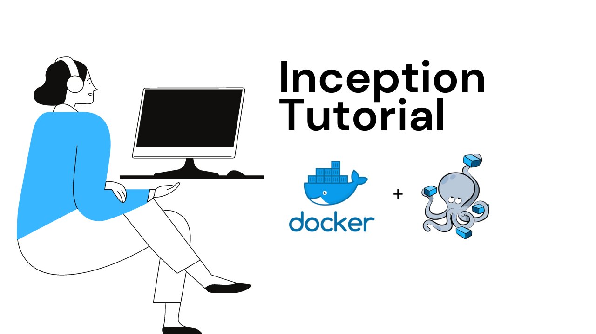
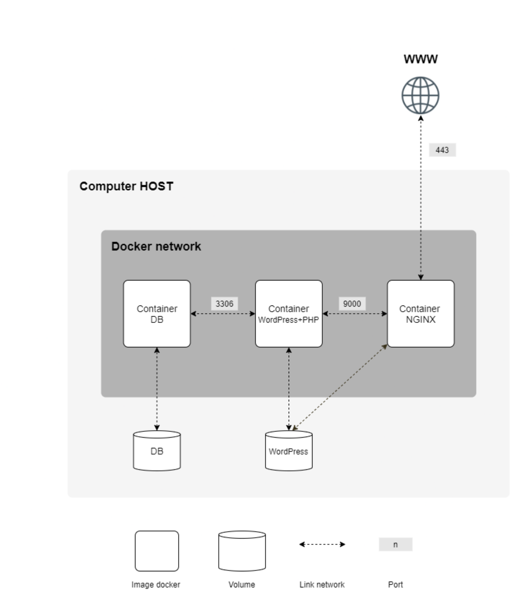
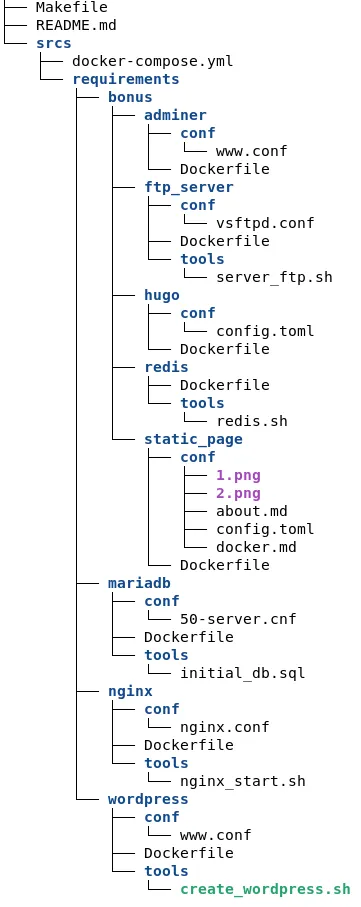
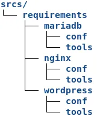
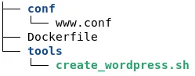
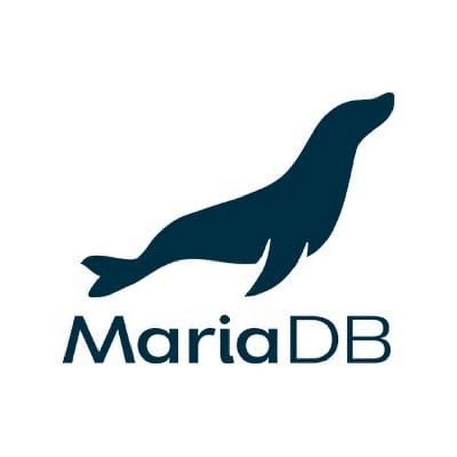
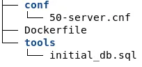
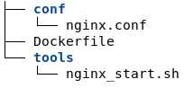
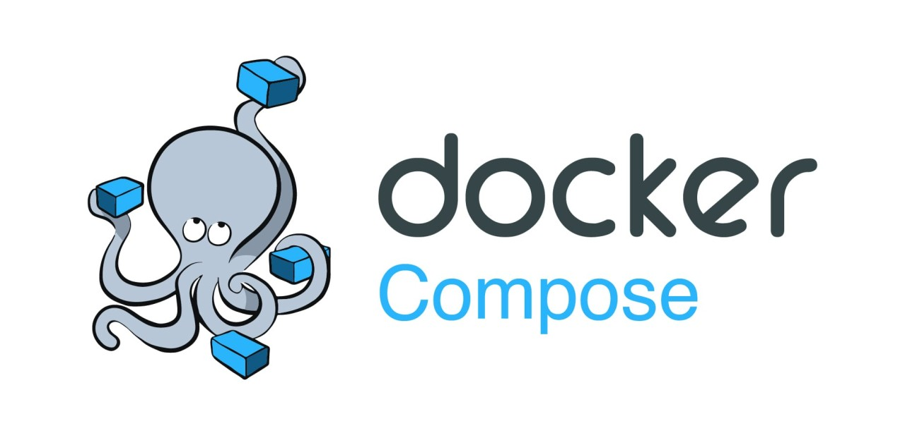

# INCEPTION 

## Project Overview

This project consists in having you set up a small infrastructure composed of different
services under specific rules. The whole project has to be done in a virtual machine. You
have to use `docker compose`.  

Each Docker image must have the same name as its corresponding service.
Each service has to run in a dedicated container.
For performance matters, the containers must be built either from the penultimate stable
version of `Alpine or Debian`. The choice is yours.
You also have to write your own <b>Dockerfiles</b>, one per service. The Dockerfiles must
be called in your `docker-compose.yml` by your Makefile.
It means you have to build yourself the Docker images of your project. It is then forbidden to pull ready-made Docker images, as well as using services such as DockerHub
(Alpine/Debian being excluded from this rule).  

You then have to set up:  
• A Docker container that contains NGINX with TLSv1.2 or TLSv1.3 only. 
• A Docker container that contains WordPress + php-fpm (it must be installed and
configured) only without nginx.  
• A Docker container that contains MariaDB only without nginx. 
• A volume that contains your WordPress database. 
• A second volume that contains your WordPress website files. 
• A docker-network that establishes the connection between your containers. 

>Your containers have to restart in case of a crash. 

• In your WordPress database, there must be two users, one of them being the administrator. The administrator’s username can’t contain admin/Admin or administrator/Administrator (e.g., admin, administrator, Administrator, admin-123, and
so forth). 

>To make things simpler, you have to configure your domain name so it points to your
local IP address. 
This domain name must be login.42.fr. Again, you have to use your own login.
For example, if your login is wil, wil.42.fr will redirect to the IP address pointing to
wil’s website.  

Here is an example diagram of the expected result:

Below is an example of the expected directory structure: 

## Getting Started

What is Docker? I will not address the question here, you can read the article I wrote before. 
https://medium.com/p/419d5c9edb70
 

To briefly talk about the project, you are asked to set up a Wordpress site via Docker. However, you need to use Nginx and MariaDB services. 

This article also includes the bonus part of the project, so this page is worth 125 Points. 

In the project, you are asked to use Alpine or Debian as the operating system. I will use Debian. You can download. 
I will not explain the installation part of the system, you can install it with the settings you want via VirtualBox, it does not require any special settings. 

After turning on the system, you first need to open the terminal and enter sudo. 

The system update and Make and Docker installation are given below. <code><pre>apt-get update && apt-get install make docker.io docker-compose</pre></code>

## 📂 Creating Necessary Directories
You should go to the directory of your choice and create the srcs/requirements directories and subdirectories.
<code><pre>mkdir -p srcs/requirements{wordpress,mariadb,nginx}/{tools,conf}</pre></code>

The directory should be like this: 

## 📝 Environment - Environment Variable
Let's create a hidden file named env in the srcs directory.
<code><pre>touch .env</pre></code>

.env file is used to define environment variables that can be injected into Docker containers defined within a docker-compose.yml file. This allows for a centralized and easily manageable way to set configuration values for Dockerized applications. 

Arrange and write the following commands into the file according to your needs. 

IMPORTANT NOTE: Do not include this file when uploading your project to repo 42. Otherwise you get <b>-42</b>. 
<pre>
    <code>
        DOMAIN_NAME=mghalmi.42.fr
        MYSQL_HOSTNAME=mariadb
        MYSQL_DATABASE=wordpress
        MYSQL_USER=mghalmi
        MYSQL_PASSWORD=1234
        MYSQL_ROOT_PASSWORD=root1234
    </code>
</pre>

## 📌 Mandatory Part
### WordPress

>WordPress is a popular open-source content management system (CMS) used for creating and managing websites and blogs. It provides a user-friendly interface for building and editing web pages, making it accessible to users with varying levels of technical expertise. WordPress offers a wide range of themes and plugins that extend its functionality, allowing users to customize their websites to suit their needs. 

First, let's set up the Dockerfile in this file. Let's create a file called Dockerfile in the wordpress/ directory. 

<pre>
    <code>
        FROM debian:stable

        RUN apt upadte -y 
        RUN apt upgrade -y
        RUN apt-get update && apt-get -y install \
            wget \
            curl \
            bash \
            php \
            php-cgi \
            php-mysql \
            php-fpm \
            php-pdo \
            php-gd php-cli \
            php-mbstring \
            redis \
            php-redis

        RUN rm -rf /var/lib/apt/lists/* 

        RUN curl -O https://raw.githubusercontent.com/wp-cli/builds/gh-pages/phar/wp-cli.phar \ 
        && chmod +x wp-cli.phar \
        && mv wp-cli.phar /usr/local/bin/wp

        COPY ./conf/www.conf /etc/php/7.3/fpm/pool.d/

        COPY ./tools/create_wordpress.sh /usr/local/bin/
        RUN chmod +x /usr/local/bin/create_wordpress.sh
        ENTRYPOINT ["/usr/local/bin/create_wordpress.sh"]

        WORKDIR /var/www/html/

        EXPOSE 9000

        CMD ["/usr/sbin/php-fpm7.3", "-F"]

    </code>
</pre>

### 🔑 used commands

- <strong>FROM</strong>: Sets the Docker image to be created based on debian:buster.
- <strong>RUN</strong>: Installs the required packages. (Bash codes are executed)
- <strong>COPY</strong>: Copies file X to target Y within the created container.
- <strong>ENTRYPOINT</strong>: This is the script that will be run when the container is started.
- <strong>WORKDIR</strong>: It is the working directory.
- <strong>EXPOSE</strong>: This container can listen from outside via port 9000.
- <strong>CMD</strong>: This is the command to be run when the container is started.

### ⚙️ explanation

`FROM debian:stable`: Specifies the base image for the Docker container, which is Debian stabel. 

`RUN apt update && apt -y install ...`: Runs commands to update the package index and install required packages using apt. This includes packages like wget, curl, bash, and various PHP-related packages needed for running WordPress and its dependencies. 

`RUN rm -rf /var/lib/apt/lists/*`: clean up the package lists stored in the /var/lib/apt/lists/ directory. This directory contains cached package lists retrieved by apt during the update process. his helps speed up subsequent package installations. 

`RUN curl -O ...`: Downloads the WP-CLI (WordPress Command Line Interface) tool and makes it executable. WP-CLI is used for managing WordPress installations from the command line. 

`COPY ./conf/www.conf /etc/php/7.3/fpm/pool.d/`: Copies a custom PHP-FPM (FastCGI Process Manager) configuration file (www.conf) to the appropriate directory in the container. This file likely contains settings related to PHP-FPM pool configurations. 

`COPY ./tools/create_wordpress.sh /usr/local/bin/`: Copies a shell script (create_wordpress.sh) to /usr/local/bin/ inside the container. This script is used for initializing a WordPress installation. 

`RUN chmod +x /usr/local/bin/create_wordpress.sh`: Changes the permissions of the shell script to make it executable. 

`ENTRYPOINT ["/usr/local/bin/create_wordpress.sh"]`: Sets the entry point for the container to the create_wordpress.sh script. This means that when the container starts, it will execute this script. 

`WORKDIR /var/www/html/`: Sets the working directory inside the container to /var/www/html/, where the WordPress files will be placed. this equivalent to <b>cd</b> 

`EXPOSE 9000`: Exposes port 9000, which is typically used by PHP-FPM. 

`CMD ["/usr/sbin/php-fpm7.3", "-F"]`: Specifies the default command to run when the container starts. In this case, it starts PHP-FPM with the -F flag to run it in the foreground.

Let's go to the <b>/wordpress/conf/</b> directory, create a file named <b>www.conf</b> and write the following commands.

<pre>
    <code>
        [www]
        user = www-data
        group = www-data
        listen = wordpress:9000
        pm = dynamic
        pm.start_servers = 6
        pm.max_children = 25
        pm.min_spare_servers = 2
        pm.max_spare_servers = 10
    </code>
</pre>

### ⚙️ explanation
This is a PHP-FPM (FastCGI Process Manager) configuration file. It contains operating and performance settings. 

`[www]`: This specifies the name of the PHP pool configuration block. In this case, it's named "www". which is typically used for serving web requests. 

`user = www-data`: This sets the user under which the PHP-FPM processes will run to www-data. This is a common practice for security reasons, as running PHP processes as a less privileged user can help mitigate potential security risks. www-data It's a non-privileged user account  

`group = www-data`: Similar to the user directive, this sets the group under which the PHP-FPM processes will run to www-data. 

`listen = wordpress:9000`: This defines the address and port on which PHP-FPM will listen for FastCGI requests. In this case, it's set to wordpress:9000, meaning PHP-FPM will listen on the address wordpress and port 9000.

`pm = dynamic`: This sets the PHP process manager to "dynamic", meaning PHP-FPM will dynamically adjust the number of child processes based on the workload.

`pm.start_servers = 6`: This sets the number of PHP-FPM child processes to start when the PHP-FPM service is initially started or restarted to 6.

`pm.max_children = 25`: This sets the maximum number of child processes that PHP-FPM will allow to exist simultaneously to 25.

`pm.min_spare_servers = 2`: This sets the minimum number of spare PHP-FPM child processes that should be kept idle to handle incoming requests to 2.

`pm.max_spare_servers = 10`: This sets the maximum number of spare PHP-FPM child processes that can be kept idle to handle incoming requests to 10.

Now let's go to the <b>tools/</b> directory, create a file named <b>create_wordpress.sh</b> and write the following bash code. 
These commands download WordPress and edit the wp-config file.
<pre>
    <code>
        #!/bin/sh

        if [ -f ./wp-config.php ]
            then
                echo "Wordpress already downloaded"
            else

            curl -O https://raw.githubusercontent.com/wp-cli/builds/gh-pages/phar/wp-cli.phar
            chmod +x wp-cli.phar
            mv wp-cli.phar /usr/local/bin/wp

            wp core download --allow-root

            wp config create --dbname=$MYSQL_DATABASE --dbuser=$MYSQL_USER --dbpass=$MYSQL_PASSWORD --dbhost=$MYSQL_HOSTNAME --allow-root

            wp core install --url=$DOMAIN_NAME --title="Inception" --admin_user=$WORDPRESS_ADMIN_USER --admin_password=$WORDPRESS_ADMIN_PASSWORD --admin_email=$WORDPRESS_ADMIN_EMAIL --allow-root
            wp user create $WORDPRESS_USER $WORDPRESS_USER_EMAIL --role=subscriber --user_pass=$WORDPRESS_USER_PASSWORD --allow-root
        fi

        exec "$@"
    </code>
</pre>

### ⚙️ explanation

`if [ -f ./wp-config.php ]`: checks if the file wp-config.php exists in the current directory. The -f flag test checks if the file exists. 

>if the file exists it prints a message saying "Wordpress already downloaded". 

>if not :  

`curl -O https://raw.githubusercontent.com/wp-cli/builds/gh-pages/phar/wp-cli.phar` : This command downloads the WP-CLI (WordPress Command Line Interface) Phar (PHP Archive) file from the specified URL. WP-CLI is a command-line tool for managing WordPress installations. The -O option tells curl to write the output to a local file with the same name as the remote file. 
`chmod +x wp-cli.phar`: This command makes the downloaded WP-CLI Phar file executable by changing its permissions. The +x option adds the execute permission to the file. 
`mv wp-cli.phar /usr/local/bin/wp`: This command moves the WP-CLI Phar file to the /usr/local/bin directory and renames it to wp. This allows you to execute WP-CLI commands conveniently from the command line by simply typing wp.  
`wp core download --allow-root`: This WP-CLI command downloads the latest version of the WordPress core files to the current directory. The --allow-root option is used to allow running WP-CLI commands as the root user. 

`wp config create --dbname=$MYSQL_DATABASE --dbuser=$MYSQL_USER --dbpass=$MYSQL_PASSWORD --dbhost=$MYSQL_HOSTNAME --allow-root`: This WP-CLI command generates a wp-config.php file with the database connection details provided as arguments. This file is essential for WordPress to connect to the database. 

`wp core install --url=$DOMAIN_NAME --title="Inception" --admin_user=$WORDPRESS_ADMIN_USER --admin_password=$WORDPRESS_ADMIN_PASSWORD --admin_email=$WORDPRESS_ADMIN_EMAIL --allow-root`: This WP-CLI command installs WordPress with the specified configuration. It sets up the site URL, title, admin username, password, and email address. 

`wp user create $WORDPRESS_USER $WORDPRESS_USER_EMAIL --role=subscriber --user_pass=$WORDPRESS_USER_PASSWORD --allow-root`: This WP-CLI command creates a new WordPress user with the specified username, email address, and role (subscriber). The --user_pass option sets the password for the user.

 

`fi`: else block is terminated here with fi, marking the end of the conditional execution. 

`exec "$@"`: executes any additional command-line arguments passed to the script. This allows users to run additional commands after the WordPress setup is complete.  

The wordpress/ directory will be as follows: 

### 💣 MariaDB

Let's go to the mariadb/ directory and create the Dockerfile file. 

<pre>
    <code>
        FROM debian:stable

        RUN apt update -y
        RUN apt install -y mariadb-server

        EXPOSE 3306

        COPY ./conf/50-server.cnf /etc/mysql/mariadb.conf.d/
        COPY ./tools /var/www/

        RUN service mysql start && mysql < /var/www/initial_db.sql && rm -f /var/www/initial_db.sql;

        CMD ["mysqld"]
    </code>
</pre>

### ⚙️ explanation
`FROM debian:stabel`: This line specifies the base image for the Docker container, which is Debian Buster.

`EXPOSE 3306`: This instruction exposes port 3306, the default port used by MariaDB, to allow connections from other containers or the host system.

`RUN service mysql start && mysql < /var/www/initial_db.sql && rm -f /var/www/initial_db.sql`: This line starts the MariaDB service (service mysql start), executes an SQL script (mysql < /var/www/initial_db.sql) to initialize the database with initial data, and then removes the SQL script file to clean up (rm -f /var/www/initial_db.sql). This is typically done in one RUN instruction to reduce the number of layers in the Docker image.

`CMD ["mysqld"]`: This command specifies the default command to run when the container starts. In this case, it starts the MariaDB server (mysqld), allowing the container to function as a MariaDB database server by default.

Let's go to the conf/ directory and create a file named 50-server.cnf. 
This file contains the basic configuration settings of MariaDB.

<pre>
    <code>
        [mysqld]

        user                    = mysql
        pid-file                = /run/mysqld/mysqld.pid
        socket                  = /run/mysqld/mysqld.sock
        port                    = 3306
        basedir                 = /usr
        datadir                 = /var/lib/mysql
        tmpdir                  = /tmp
        lc-messages-dir         = /usr/share/mysql

        query_cache_size        = 16M
        log_error = /var/log/mysql/error.log
        expire_logs_days        = 10
        character-set-server    = utf8mb4
        collation-server        = utf8mb4_general_ci
    </code>
</pre>

### ⚙️ explanation

`[mysqld]`: This section header indicates that the configuration settings that follow are specific to the MySQL server daemon (mysqld). 

`user = mysql`: Specifies the user under which the MySQL server process (mysqld) runs. Typically, it's the user mysql. 

`pid-file = /run/mysqld/mysqld.pid`: Specifies the location of the process ID (PID) file. This file contains the process ID of the MySQL server process. 

`socket = /run/mysqld/mysqld.sock`: Specifies the location of the Unix socket file used for local client connections to the MySQL server.

`port = 3306`: Specifies the port on which the MySQL server listens for TCP/IP connections. The default port for MySQL is 3306. 

`basedir = /usr`: Specifies the base directory where MySQL binaries, libraries, and other files are located. 

`datadir = /var/lib/mysql`: Specifies the directory where MySQL stores its data files, including databases and tables. 

`tmpdir = /tmp`: Specifies the directory where MySQL stores temporary files, such as temporary tables or query results. 

`lc-messages-dir = /usr/share/mysql`: Specifies the directory where MySQL localization messages are stored. 

`query_cache_size = 16M`: Sets the size of the query cache, which is used to cache the results of SELECT queries. Here, it's set to 16 megabytes (16M). 

`log_error = /var/log/mysql/error.log`: Specifies the location of the error log file, where MySQL writes error messages and diagnostic information. 

`expire_logs_days = 10`: Specifies the number of days to retain binary log files before they are automatically purged. Here, it's set to 10 days. 

`character-set-server = utf8mb4`: Sets the default character set for data stored in the database to UTF-8 encoding (utf8mb4), which supports a broader range of characters compared to traditional UTF-8. 

`collation-server = utf8mb4_general_ci`: Sets the default collation for data stored in the database to UTF-8 Unicode (utf8mb4_general_ci), which is case-insensitive. This collation is suitable for general use with UTF-8 encoded data. 

Let's go to the tools/ directory and create a file named initial_db.sql. 
These SQL commands create a database for WordPress. It allows adding a new user, granting the necessary permissions to the user, and changing the password.

<pre>
    <code>
        CREATE DATABASE IF NOT EXISTS wordpress;
        CREATE USER IF NOT EXISTS 'mghalmi'@'%' IDENTIFIED BY '1234';
        GRANT ALL PRIVILEGES ON wordpress.* TO 'mghalmi'@'%';
        FLUSH PRIVILEGES;
        ALTER USER 'root'@'localhost' IDENTIFIED BY 'root1234';
    </code>
</pre>

### ⚙️ explanation

`CREATE DATABASE IF NOT EXISTS wordpress;`:
This command creates a new database named "wordpress" if it doesn't already exist.
The IF NOT EXISTS clause ensures that the database is created only if it doesn't already exist.
 

`CREATE USER IF NOT EXISTS 'mghalmi'@'%' IDENTIFIED BY '1234';`:This command creates a new user named "mghalmi" with the password "1234".
The IF NOT EXISTS clause ensures that the user is created only if it doesn't already exist.
'%' specifies that the user can connect from any host. If you want to restrict connections to a specific host, you would replace '%' with the hostname or IP address. 

`GRANT ALL PRIVILEGES ON wordpress. TO 'mghalmi'@'%';`:
This command grants all privileges on the "wordpress" database to the user "mghalmi".
The .* notation after the database name specifies that all tables within the "wordpress" database will be affected by this privilege grant. 

`FLUSH PRIVILEGES;`:
This command reloads the MySQL privileges to ensure that the changes made by the GRANT statement are applied immediately.
Without this command, changes to user privileges may not take effect until the server is restarted or privileges are reloaded. 

`ALTER USER 'root'@'localhost' IDENTIFIED BY 'root1234';`:
This command changes the password for the root user to "root1234".
It's a good practice to set a strong password for the root user to enhance security. 

The mariadb/ directory will be like this:
 

### 🛡 Nginx

Nginx is a powerful and versatile web server software that offers performance, scalability, and flexibility for serving web content and managing web traffic in modern web environments. 
Let's go to the nginx/ directory and create the Dockerfile file.

<pre>
    <code>
        FROM debian:stable

        RUN apt update && apt install -y nginx openssl

        RUN mkdir /etc/nginx/ssl

        COPY ./conf/nginx.conf /etc/nginx/sites-enabled/default
        COPY ./tools/nginx_start.sh /var/www

        RUN chmod +x /var/www/nginx_start.sh
        RUN mkdir -p /run/nginx

        ENTRYPOINT ["var/www/nginx_start.sh"]

        EXPOSE 443

        CMD ["nginx", "-g", "daemon off;"]
    </code>
</pre>

### ⚙️ explanation
`CMD ["nginx", "-g", "daemon off;"]`: This is the command and its parameters specified in the form of a JSON array.

- "nginx": This is the command to run when the container starts. In this case, it's the Nginx web server executable.

- "-g": This is an option flag for Nginx that allows specifying global configurations inline. In this case, it's used to provide the daemon off; directive.

- "daemon off;": This directive is used to prevent Nginx from running in the background as a daemon. It keeps Nginx running in the foreground, which is necessary for Docker containers to remain running.

Let's go to the conf/ directory and create the nginx.conf file.

<pre>
        server {
            # 443 listens on the port and connects to the mghalmi.42.fr server
            listen 443 ssl;
            listen [::]:443 ssl;
            server_name mghalmi.42.fr;

            # SSL determines its certificates (creates it in the tools file)
            ssl_certificate  /etc/nginx/ssl/nginx.crt;
            ssl_certificate_key /etc/nginx/ssl/nginx.key;
            ssl_protocols  TLSv1.2 TLSv1.3;

            # Default directory on server
            root /var/www/html;
            index index.php index.nginx-debian.html;

            # It matches incoming requests in order. $uri, index.php and incoming arguments
            location / {
            try_files $uri $uri/ /index.php$is_args$args;
            }

            # PHP Determines requests to files
            location ~ \.php$ {
            fastcgi_split_path_info ^(.+\.php)(/.+)$;
            fastcgi_pass wordpress:9000;
            fastcgi_index index.php;
            include fastcgi_params;
            fastcgi_param SCRIPT_FILENAME $document_root$fastcgi_script_name;
            fastcgi_param SCRIPT_NAME $fastcgi_script_name;
            }
        }
</pre>

### ⚙️ explanation

- Server Block:

Begins with `server { and ends with }`: Defines the settings for a particular server block.

- Listen Directive:

`listen 443 ssl;`: Listens for HTTPS connections on port 443. 

`listen [::]:443 ssl;`: Listens for IPv6 HTTPS connections on port 443. 

- Server Name:

`server_name mghalmi.42.fr;`: Specifies the server name that this configuration applies to.

- SSL Configuration:
 
SSL stands for Secure Sockets Layer, and it is a cryptographic protocol used to establish secure communication over a computer network. SSL ensures that data transmitted between a client (such as a web browser) and a server (such as a website) is encrypted and protected from eavesdropping, tampering, or interception by malicious actors. 

`ssl_certificate` and `ssl_certificate_key`: Specifies the paths to the SSL certificate and private key files.<rbr>

`ssl_protocols TLSv1.2 TLSv1.3;`: Specifies the SSL/TLS protocols to be used.

- Root Directive:

`root /var/www/html;`: Sets the root directory for serving files.

- Index Directive:

`index index.php index.nginx-debian.html;`: Specifies the default files to serve when a directory is requested. 

- Location Blocks:

`Location /`: Handles requests for static files and passes PHP requests to the PHP FastCGI Process Manager (PHP-FPM). 

`try_files $uri $uri/ /index.php$is_args$args;`: Tries to serve the requested URI directly, then tries the URI as a directory, and finally passes the request to index.php if neither exists.  

`Location ~ \.php$`: Handles requests for PHP files. 

`fastcgi_pass wordpress:9000;`: Forwards PHP requests to the PHP-FPM server listening on port 9000. 
`fastcgi_param SCRIPT_FILENAME $document_root$fastcgi_script_name;`: Sets the SCRIPT_FILENAME parameter required by PHP-FPM. 

Let's create a file named nginx_start.sh in the tools/ directory. 
We will create the SSL Certificate using OpenSSL.

<pre>
    <code>
        #!/bin/bash

        if [ ! -f /etc/nginx/ssl/nginx.crt ]; then
            echo "Nginx: setting up ssl ...";
            openssl req -x509 -nodes -days 365 -newkey rsa:4096 -keyout /etc/nginx/ssl/nginx.key -out /etc/nginx/ssl/nginx.crt -subj "/C=TR/ST=KOCAELI/L=GEBZE/O=42Kocaeli/CN=ehazir.42.fr";
            echo "Nginx: ssl is set up!";
        fi

        exec "$@"
    </code>
</pre>

### ⚙️ explanation

` if [ ! -f /etc/nginx/ssl/nginx.crt ];`: This if statement checks if the SSL/TLS certificate file (nginx.crt) does not exist in the specified directory (/etc/nginx/ssl/). 

if the ssl.tls certificate file does not exist 

`openssl req -x509 -nodes -days 365 -newkey rsa:4096 -keyout /etc/nginx/ssl/nginx.key -out /etc/nginx/ssl/nginx.crt -subj "/C=TR/ST=KOCAELI/L=GEBZE/O=42Kocaeli/CN=mghalmi.42.fr";` : The script generates a self-signed SSL/TLS certificate (nginx.crt) and private key (nginx.key) using the openssl req command The generated certificate is valid for 365 days (-days 365), and a new RSA private key of length 4096 bits (-newkey rsa:4096) is generated. The -subj option specifies the subject of the certificate, including the country (C), state (ST), locality (L), organization (O), and common name (CN). x509: Creates signed certificate.

The nginx/ directory will be like this:

### 🚢 Docker Compose Configuration:

Let's go to the srcs/ directory and open a file named docker-compose.yml. 

I wrote the explanations as comment lines in the file.

<pre>
    <code>
        # File version
        version: '3'

        # Services (Container) settings
        services:

        nginx:
            # Container Name to be Created
            container_name: nginx

            # Dockerfile file path
            build: ./requirements/nginx

        # Specifies the containers to which the container is connected before initializing it.
            # To be listened to: Ports to be forwarded
            ports:
            - 443:443
            
            # Directory where files will be stored
            volumes:
            - wordpress_data:/var/www/html

            # Automatically restarts the container
            restart: always

            # The way that the container is connected to
            networks:
            - network

        mariadb:
            container_name: mariadb
            build: ./requirements/mariadb
            volumes:
            - mariadb_data:/var/lib/mysql
            networks:
            - network
            restart: always

            # Assigns the data in the .env file to environment variables
            env_file:
            - .env

        wordpress:
            container_name: wordpress
            depends_on:
            - mariadb
            build:
            context: ./requirements/wordpress
            dockerfile: Dockerfile
            restart: always
            env_file:
            - .env
            volumes:
            - wordpress_data:/var/www/html
            networks:
            - network

        # It stores service data and establishes a connection with the main system..
        volumes:
        mariadb_data:
            driver: local
            driver_opts:
            type: none
            device: /home/data/mysql
            o: bind
        wordpress_data:
            driver: local
            driver_opts:
            type: none
            device: /home/data/wordpress
            o: bind

        # Connects to default network drive
        networks:
        network:
            driver: bridge
    </code>
</pre>

### 🎯 Makefile 

Let's go to the main directory of the project (before srcs) and create a Makefile file. 

<pre>
    <code>
      
        DC := docker-compose -f ./srcs/docker-compose.yml

        all:
            @mkdir -p /home/data/wordpress
            @mkdir -p /home/data/mysql
            @$(DC) up -d --build

        down:
            @$(DC) down

        re: clean all

        clean:
            @$(DC) down -v --remove-orphans     # Down stops containers and removes connected volumes
            @docker rmi -f $$(docker images -q) # Deletes unused images

        .PHONY: all down re clean

    </code>
</pre>

#### 42.fr Link - etc/hosts

In order to connect to x.42.fr, we need to edit the hosts file. To do this, open the hosts file in the etc/ directory. 

You will see a file similar to the one below. 

<pre>
    <code>
        127.0.0.1 localhost
        127.0.1.1 debian

        # The following lines are desirable for IPv6 capable hosts
        ::1     localhost ip6-localhost ip6-loopback
        ff02::1 ip6-allnodes
        ff02::2 ip6-allrouters
    </code>
</pre>

Add the new host as 127.0.1.2 mghalmi.42.fr. 
Don't forget to write your own username instead of mghalmi :) 

### 🚀 Operation - Make
Let's go to the directory where the Makefile is located and type make and wait until the process is finished. The process takes a little long. After the process is completed, we can see our active containers by typing docker ps in the terminal. 

You can access your WordPress site by entering the IP addresses written in the hosts file with your browser. 
